# Deploy Shardnet node

## System Requirements
The server spec must meet at least 8 CPU cores (vCores) and 16GB of RAM. The NEAR service will store NEAR blockchain data, you need to attach at least 120GB SSD for that directory (when we wrote this article; it changes continuously).

## Buy a Server
We used the Hetzner data center for our Shardnet usage. Look at the table to see how much we pay monthly for that specific validator.

The server type is "CPX41", it includes 8 AMD EPYC CPU cores, 16GB RAM, 240GB SSD, and 20TB network bandwidth.
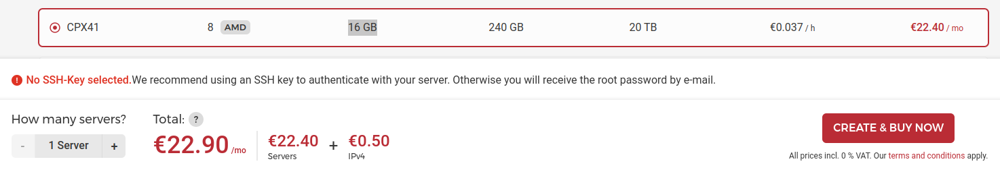

## Verify CPU
The [nearcore](https://github.com/near/nearcore) service needs the AVX CPU extension to run. In this case, we can evaluate if our machine has supported this extension or not:
```
lscpu | grep -P '(?=.*avx )(?=.*sse4.2 )(?=.*cx16 )(?=.*popcnt )' > /dev/null && echo "Supported" || echo "Not supported"
```
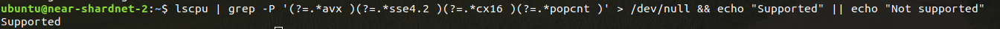

## Open Ports

The NEAR service on your machine must connect to other peers in the network, so you should open all of your outbound ports (TCP and UDP), and the following ports as inbound:
- 3030
- 24567

**Optional:** You can also check if the server ports are open from your local machine using `nmap`​ or `telnet`​:
```
telnet <server ip> 3030
telnet <server ip> 24567

# or
nmap <server ip> -p 3030
nmap <server ip> -p 24567
```

## Dependencies
### Update repositories
```
sudo apt update -y
```
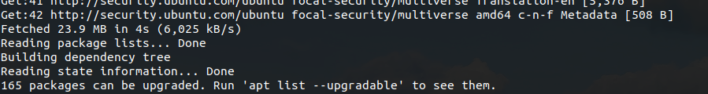
Then, install the required packages:
```
sudo apt install -y git binutils-dev libcurl4-openssl-dev zlib1g-dev libdw-dev libiberty-dev cmake gcc g++ python3 docker.io protobuf-compiler libssl-dev pkg-config clang llvm cargo python3-pip build-essential make
```
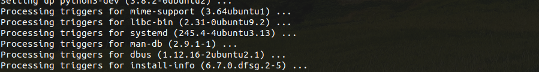

### Install rust
```
curl --proto '=https' --tlsv1.2 -sSf https://sh.rustup.rs | sh -s -- -y
```
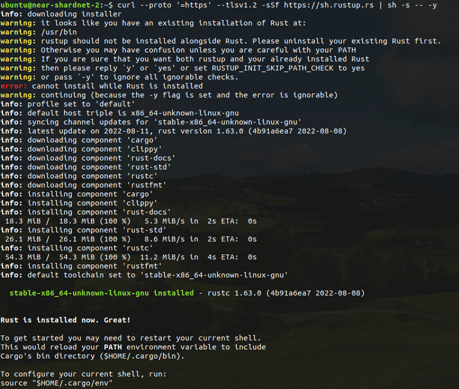

## Build & Compile `​nearcore`
We need to build `nearcore` project to have a `neard` binary file for running our NEAR node. Let's set the cargo/rust environment variables:
```
source "$HOME/.cargo/env"
```
> This command has no output. 

Then, clone the nearcore [repository](https://github.com/near/nearcore):
```
git clone https://github.com/near/nearcore
cd nearcore
git fetch
```
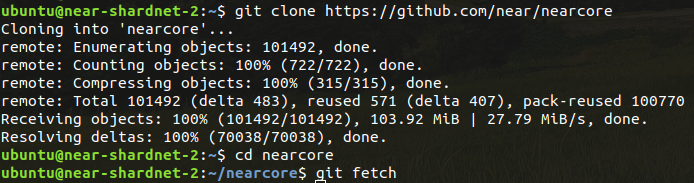
Checkout the commit as [this file](https://github.com/near/stakewars-iii/blob/main/commit.md), and then using that checksum:
```
git checkout f7f0cb22e85e9c781a9c71df7dcb17f507ff6fde
```
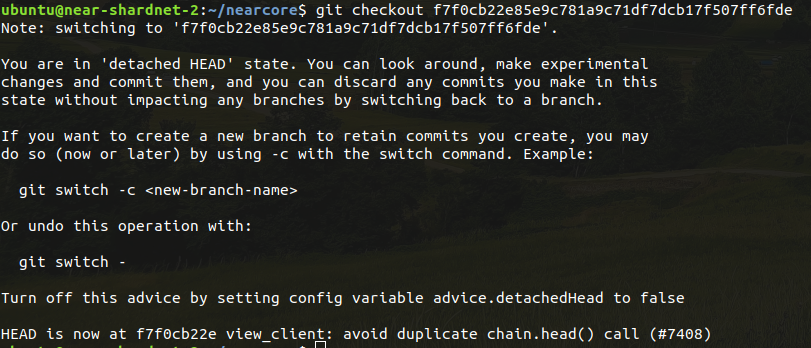

**Compile `nearcore` binary**
```
cargo build -p neard --release --features shardnet
```
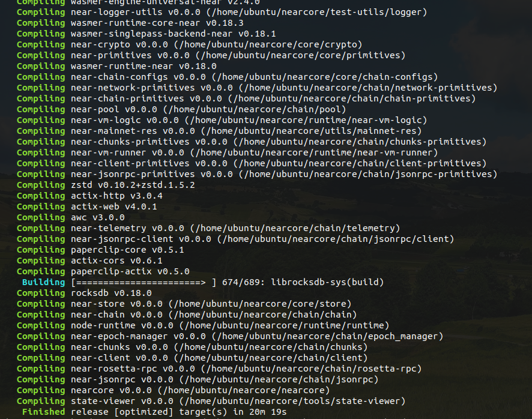
> It takes some time depending on your server resources (e.g CPU cores). 

**Initialize `neard`​ working directory**
```
./target/release/neard --home ~/.near init --chain-id shardnet --download-genesis
```
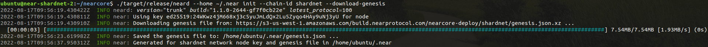

**Replace the `config.json​`**
```
rm ~/.near/config.json
wget -O ~/.near/config.json https://s3-us-west-1.amazonaws.com/build.nearprotocol.com/nearcore-deploy/shardnet/config.json
```
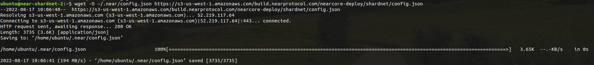

## Run the NEAR
**Test running the node**
```
cd ~/nearcore
./target/release/neard --home ~/.near run
```
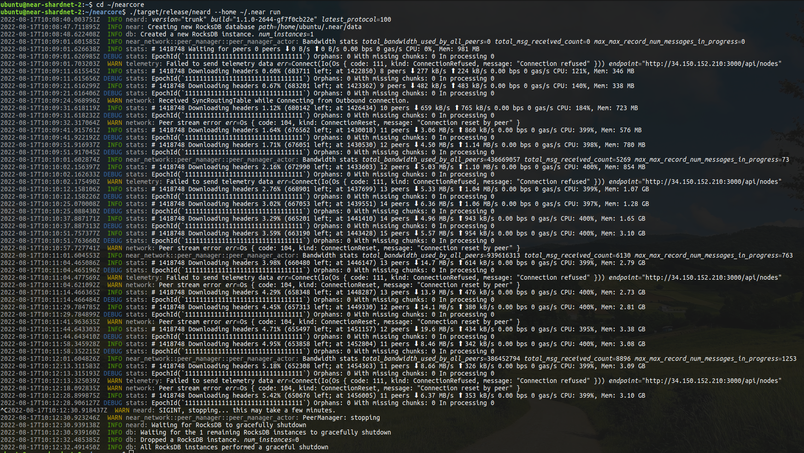
> Try to stop the node by hitting CTRL+C, we will run the node as a systemd service.

**Create NEAR systemd service**
If you want to run a command or a binary file to be up and running in the background (even if you close your SSH session to the server), you should better create a [systemd service](https://en.wikipedia.org/wiki/Systemd).

Create an empty service file:
```
sudo touch /etc/systemd/system/neard.service
```
> This command has no output.

Open up the service file with your preferred editor (`​nano`​ in our example):
```
sudo nano /etc/systemd/system/neard.service
```
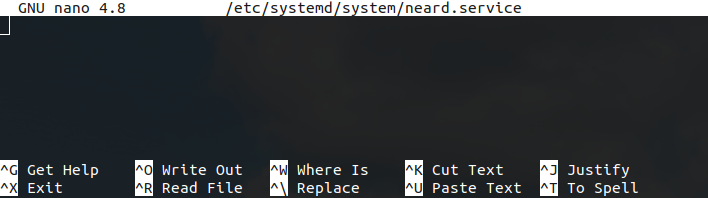
Then, add/paste these lines there:
```
[Unit]
Description=NEARd Daemon Service

[Service]
Type=simple
User=ubuntu
WorkingDirectory=/home/ubuntu/.near
ExecStart=/home/ubuntu/nearcore/target/release/neard run
Restart=on-failure
RestartSec=30
KillSignal=SIGINT
TimeoutStopSec=45
KillMode=mixed

[Install]
WantedBy=multi-user.target
```
> Ensure that you change all of the "`​ubuntu​`" values in this file to your user because we used the default `ubuntu` user on our ubuntu server!

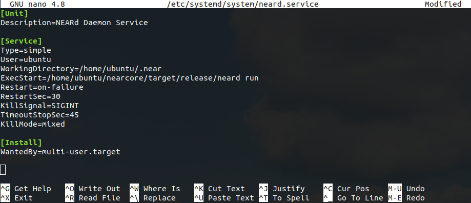
> After pasting, you can hit CTRL+S to save then CTRL+X to exit the editor.

**Run the `neard` service**
Check if the `neard​` service exists:
```
systemctl list-unit-files --type service | grep neard
```


If so, enable and start the service:
```
sudo systemctl enable neard
sudo service neard start
```
> These commands have no output.

You can check the logs of the `neard` service using `journalctl`:

```
journalctl -u neard -f -n 100
```
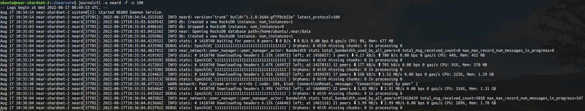
Well done, the shardnet node is up and running and you have to wait for it to download the latest headers, then, catches the latest block. After all, you can reconfigure this node to work as a NEAR Shardnet validator.