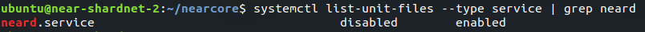

# Deploy Shardnet node

## System Requirements
The server spec must meet at least 8 CPU cores (vCores) and 16GB of RAM. The NEAR service will store NEAR blockchain data, you need to attach at least 120GB SSD for that directory (when we wrote this article; it changes continuously).

## Buy a Server
We used the Hetzner data center for our Shardnet usage. Look at the table to see how much we pay monthly for that specific validator.

The server type is "CPX41", it includes 8 AMD EPYC CPU cores, 16GB RAM, 240GB SSD, and 20TB network bandwidth.


## Verify CPU
The [nearcore](https://github.com/near/nearcore) service needs the AVX CPU extension to run. In this case, we can evaluate if our machine has supported this extension or not:
```
lscpu | grep -P '(?=.*avx )(?=.*sse4.2 )(?=.*cx16 )(?=.*popcnt )' > /dev/null && echo "Supported" || echo "Not supported"
```


## Open Ports

The NEAR service on your machine must connect to other peers in the network, so you should open all of your outbound ports (TCP and UDP), and the following ports as inbound:
- 3030
- 24567

**Optional:** You can also check if the server ports are open from your local machine using `nmap`​ or `telnet`​:
```
telnet <server ip> 3030
telnet <server ip> 24567

# or
nmap <server ip> -p 3030
nmap <server ip> -p 24567
```

## Dependencies
### Update repositories
```
sudo apt update -y
```

Then, install the required packages:
```
sudo apt install -y git binutils-dev libcurl4-openssl-dev zlib1g-dev libdw-dev libiberty-dev cmake gcc g++ python3 docker.io protobuf-compiler libssl-dev pkg-config clang llvm cargo python3-pip build-essential make
```


### Install rust
```
curl --proto '=https' --tlsv1.2 -sSf https://sh.rustup.rs | sh -s -- -y
```


## Build & Compile `​nearcore`
We need to build `nearcore` project to have a `neard` binary file for running our NEAR node. Let's set the cargo/rust environment variables:
```
source "$HOME/.cargo/env"
```
> This command has no output. 

Then, clone the nearcore [repository](https://github.com/near/nearcore):
```
git clone https://github.com/near/nearcore
cd nearcore
git fetch
```

Checkout the commit as [this file](https://github.com/near/stakewars-iii/blob/main/commit.md), and then using that checksum:
```
git checkout f7f0cb22e85e9c781a9c71df7dcb17f507ff6fde
```


**Compile `nearcore` binary**
```
cargo build -p neard --release --features shardnet
```

> It takes some time depending on your server resources (e.g CPU cores). 

**Initialize `neard`​ working directory**
```
./target/release/neard --home ~/.near init --chain-id shardnet --download-genesis
```


**Replace the `config.json​`**
```
rm ~/.near/config.json
wget -O ~/.near/config.json https://s3-us-west-1.amazonaws.com/build.nearprotocol.com/nearcore-deploy/shardnet/config.json
```


## Run the NEAR
**Test running the node**
```
cd ~/nearcore
./target/release/neard --home ~/.near run
```

> Try to stop the node by hitting CTRL+C, we will run the node as a systemd service.

**Create NEAR systemd service**
If you want to run a command or a binary file to be up and running in the background (even if you close your SSH session to the server), you should better create a [systemd service](https://en.wikipedia.org/wiki/Systemd).

Create an empty service file:
```
sudo touch /etc/systemd/system/neard.service
```
> This command has no output.

Open up the service file with your preferred editor (`​nano`​ in our example):
```
sudo nano /etc/systemd/system/neard.service
```

Then, add/paste these lines there:
```
[Unit]
Description=NEARd Daemon Service

[Service]
Type=simple
User=ubuntu
WorkingDirectory=/home/ubuntu/.near
ExecStart=/home/ubuntu/nearcore/target/release/neard run
Restart=on-failure
RestartSec=30
KillSignal=SIGINT
TimeoutStopSec=45
KillMode=mixed

[Install]
WantedBy=multi-user.target
```
> Ensure that you change all of the "`​ubuntu​`" values in this file to your user because we used the default `ubuntu` user on our ubuntu server!


> After pasting, you can hit CTRL+S to save then CTRL+X to exit the editor.

**Run the `neard` service**
Check if the `neard​` service exists:
```
systemctl list-unit-files --type service | grep neard
```


If so, enable and start the service:
```
sudo systemctl enable neard
sudo service neard start
```
> These commands have no output.

You can check the logs of the `neard` service using `journalctl`:

```
journalctl -u neard -f -n 100
```

Well done, the shardnet node is up and running and you have to wait for it to download the latest headers, then, catches the latest block. After all, you can reconfigure this node to work as a NEAR Shardnet validator.

# Activate the node as Validator
## Setup NEAR-CLI
NEAR-CLI is a command-line interface that communicates with the NEAR blockchain via RPC, to create transactions, check node stats, and [many more](https://github.com/near/near-cli). 
> For security reasons, it is recommended that NEAR-CLI be installed on a different computer (**your local machine**) than your NEAR node and that no full access keys be kept on your validator node.

First of all, update your machine:
```
sudo apt update -y
```


**Install Node.js and NPM**

Run the Node initial script:
```
curl -sL https://deb.nodesource.com/setup_18.x | sudo -E bash -
```

Then, install the packages:
```
sudo apt install build-essential nodejs -y
```

Ensure the packages are installed successfully:
```
node -v
npm -v
```


Finally, we can install the near-cli package:
```
sudo npm install -g near-cli
```

> The output may be different than yours.

Run the `near` command to make sure it's installed:
```
near --version
```


## Create a wallet
Follow this link to create a new wallet:
- https://wallet.shardnet.near.org/create

At first, you need to reserve an Account ID:


Then choose a security method to secure and recover your account:


We used the Passphrase method, you need to choose one of them, and after you follow the steps, you'll have a fresh account:


## Login to your Wallet Locally
Choose the NEAR pool:
```
export NEAR_ENV=shardnet
```
> This command has no output.

> We used shardnet, but there are the following possible choices: 
> - guildnet
> - testnet
> - mainnet

**Optional:** You can also run this command to set the Near testnet Environment persistent.
```
echo 'export NEAR_ENV=shardnet' >> ~/.bashrc
echo 'export NEAR_ENV=shardnet' >> ~/.bash_profile
source $HOME/.bash_profile
```
> These commands have no output.

Login to your NEAR account using near-cli:
```
near login
```
It will open up a link on your web browser. The link is like:
- https://wallet.shardnet.near.org/login/?referrer=NEAR+CLI&public_key=xxx%xxx&success_url=http%3A%2F%2F127.0.0.1%3A5000


Choose one of your accounts/wallets then hit the "Next" button. On the next page, hit the "Connect" button then fill in the account name, and finally "Confirm" it:


You should be redirected to this page:


Or may see this one:


Or this output on the terminal:


> If your machine doesn't have GUI or if you'ren't able to open a URL, use the provided URL in the command output then login there.

From now on, you can run any `near` or near-cli commands you want.

## Create a staking pool account
Generate key:
```
near generate-key <pool name>.factory.shardnet.near
```
> The `<pool name>` is the staking pool account name we will create later.


Then, store the public key on the output of the command for the next step (Use it as `<public key>​`).

The generated file is like this:
```
{
  "account_id":"xxxxxx.factory.shardnet.near",
  "public_key":"ed25519:ES7fQmiEKtMPcoNirxGggs5LazAtuz4d5PejNryEfAZd",
  "private_key":"ed25519:hCEqfQPTigTddCd26UXGyPb7yiYXCShEw2RafAY2kHc34RzwngRQx7fSDPor6rbxM6LeHvVi8FgwhGqyBz7si5m"
}
```

Rename the generated key file for the next steps, we will move this file to our NEAR node `~/.near/validator_key.json`​:
```
mv ~/.near-credentials/shardnet/{<pool name>.factory.shardnet.near,validator_key}.json
```
> The `<pool name>` is the staking pool account name.


> In fact, we have renamed the generated key file named `xxxxxx.factory.shardnet.near.json`​ to the ​`validator_key.json`​ in the `~/.near-credentials/shardnet/` path.

We must change the `private_key` to `secret_key` in the `​validator_key.json​` for NEAR to act as a Validator:
```
sed -i 's/private_key/secret_key/g' ~/.near-credentials/shardnet/validator_key.json
```
> This command has no output.

The final version of `validator_key.json​` file must be like this pattern:
```
{
  "account_id":"xxxxxx.factory.shardnet.near",
  "public_key":"ed25519:ES7fQmiEKtMPcoNirxGggs5LazAtuz4d5PejNryEfAZd",
  "secret_key":"ed25519:hCEqfQPTigTddCd26UXGyPb7yiYXCShEw2RafAY2kHc34RzwngRQx7fSDPor6rbxM6LeHvVi8FgwhGqyBz7si5m"
}
```
> The `private_key​` string changed to `secret_key​`!

Run this command to create the staking pool account:
```
near call factory.shardnet.near create_staking_pool '{"staking_pool_id": "<pool name>", "owner_id": "<owner accountId>", "stake_public_key": "<public key>", "reward_fee_fraction": {"numerator": <commission fee>, "denominator": 100}, "code_hash":"DD428g9eqLL8fWUxv8QSpVFzyHi1Qd16P8ephYCTmMSZ"}' --accountId="<caller accountId>" --amount=30 --gas=300000000000000
```
Change these values:
- `<pool name>`​: Staking pool name. If pool ID is `test​`, it will create the `​test.factory.shardnet.near`.
- `<owner accountId>`​: The admin or the owner of this staking pool account, can update and manage the staking pool like `myadmin.shardnet.near​`.
- `<caller accountId>`: The account you've logged in, like `xxx.shardnet.near​`. It actually sends the transaction to the network.
- `<public key>`​: The new public key was exported in the previous step.
- `<commission fee>`​: The fee the pool will charge (e.g. `5​` over 100 is 5% of fees).


> Make sure it prints "**true**" at the end of the output.

Congratulation, you've created your staking pool account.

## Stake NEAR tokens
There must be enough NEAR tokens deligated to your staking pool account to meet the minimum seat price! You can see the current seat price [here](https://explorer.shardnet.near.org/nodes/validators).

Deposit and stake NEAR tokens:
```
near call <pool name>.factory.shardnet.near deposit_and_stake --amount <stake amount> --accountId <caller accountId> --gas=300000000000000
```

Change these values:
- `<pool name>​`: Staking pool name. 
- `<stake amount>`​: Amount of NEAR tokens for the stake.
- `<caller accountId>`: The account you've logged in to.


## Check the staking pool account
If everything goes well, you will see your account in the proposal set. To check it, run this command:
```
near proposals
```


> You can also `grep`/find your account from the list:
> ```
> near proposals | grep "<pool name>"
> ```
> 

If you didn't find your account on the proposal set, it may pass this step (which usually takes 2-3 epochs). So, try to find it on other sets:
```
near validators next
```

If you found your account in the validator next set, it means it'll be in the validator set in the next epoch hence you should wait until the end of the current epoch.

Also, If it wasn't also in this set, try to find it on the final validator sets:
```
near validators current
```

However, you may not find your staking pool account even in none of the sets above. In this case, if you correctly created the account, you need to ping the account to make it live again.

> A ping issues a new proposal and updates the staking balances for your delegators.

```
near call <pool name>.factory.shardnet.near ping '{}' --accountId <caller accountId> --gas=300000000000000
```

And then, try again to find it in the proposal set.

## Deploy staking pool account
In this stage, we deploy the validator_key.json​ to NEAR node for activating it as a Validator. To do so, we need to SCP the file or simply copy-paste it (not secure) to the machine.
```
scp ~/.near-credentials/shardnet/validator_key.json <machine user>:<machine ip>:/home/<machine user>/.near/
```
Change these values:
- `<machine user>`​: The user that you can create an SSH session and the `.near` directory is placed.
- `<machine ip>`​: Public or private IP address of your NEAR node.

Ensure that the file is deployed successfully. In this case, connect to the NEAR node machine and cat the validator file in ~/.near/validator_key.json​.

> Check if your NEAR directory is `~/.near`​ and you have all of the following files and directory there:
> - `config.json`
> - `data/`
> - `genesis.json`
> - `node_key.json`
> - `validator_key.json`
>
> Otherwise, move the `validator_key.json​` next to the path other files are placed. 

After all, restart the `neard` service on the NEAR node machine:
```
sudo service neard restart
```
> This command has no output.

# Useful links
- Check your pool is now visible on [NEAR explorer](https://explorer.shardnet.near.org/nodes/validators) or find it from the [Stake Wars scoreboard](https://openshards.io/shardnet-uptime-scoreboard).